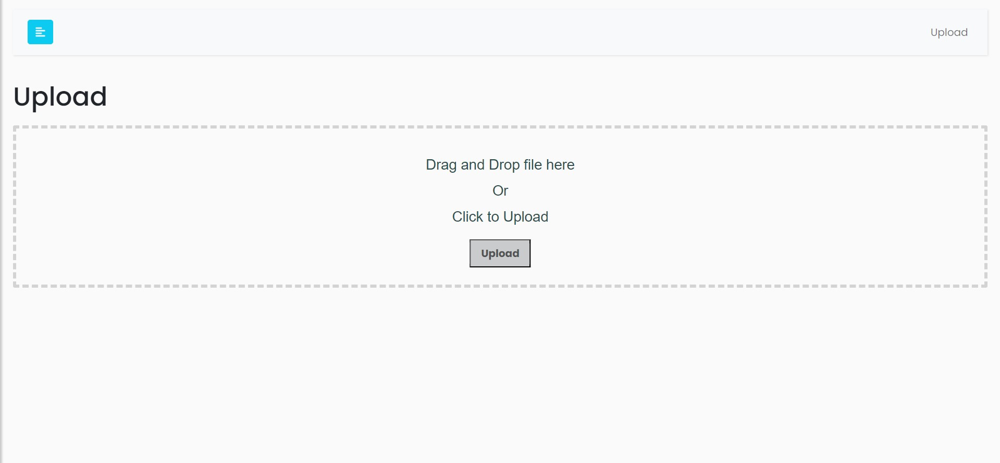

# Fastapi Web App


## Installation & Usage

```bash
$ git clone (url)
$ cd fastapi-web-starter
$ pip install -r requirements.txt
$ uvicorn app.main:app --reload --port 8080
```

 [http://127.0.0.1:8080/](http://127.0.0.1:8080/).



Uploaded files: static/upload/